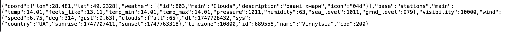
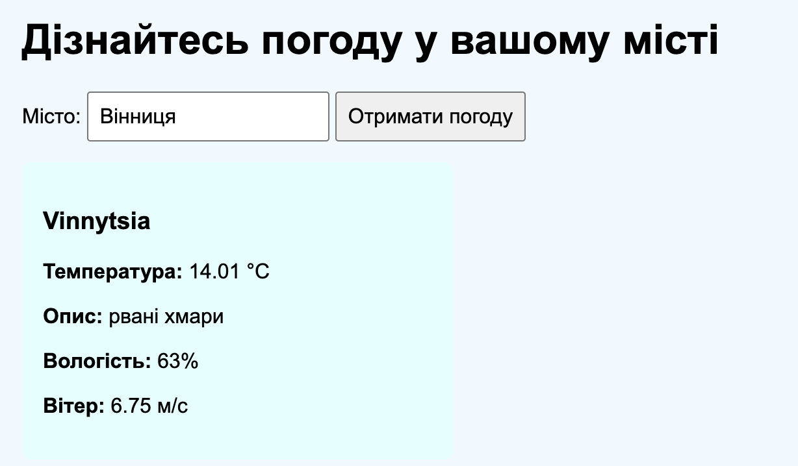

# Приклад використання API OpenWeatherMap
Цей проєкт демонструє використання публічного API для отримання прогнозу погоди за назвою міста.  
Дані беруться з сервісу https://openweathermap.org/api.

## Сценарій використання
Користувач відкриває HTML-сторінку `laba5.html`, вводить назву будь-якого міста українською або англійською мовою, після чого:
1. Відбувається запит до зовнішнього API OpenWeatherMap.
наприклад: https://api.openweathermap.org/data/2.5/weather?q=Vinnytsia&appid=804c5b752e9e331700b1bc25509c985a&units=metric&lang=ua

2. API повертає відповідь у форматі JSON.
   
Ось приклад відповіді (JSON), отриманої після введення міста Вінниця:

3. API повертає всі характеристики, однак для прикладу ми виводитимемо лише:
   - Назву міста;
   - Температуру в Цельсіях;
   - Опис погодних умов;
   - Вологість повітря;
   - Швидкість вітру.
4.  Отримана інформація виводиться безпосередньо на веб-сторінку в блоці результату.
  Приклад вигляду HTML-сторінки після запиту: 

